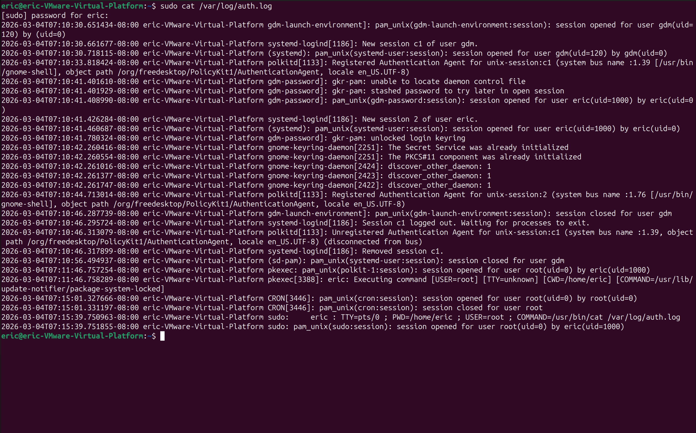
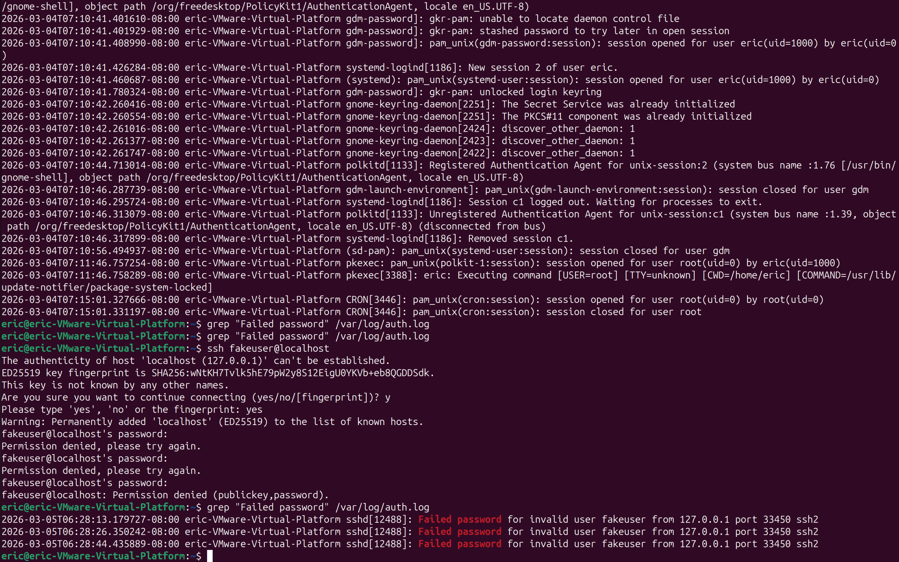
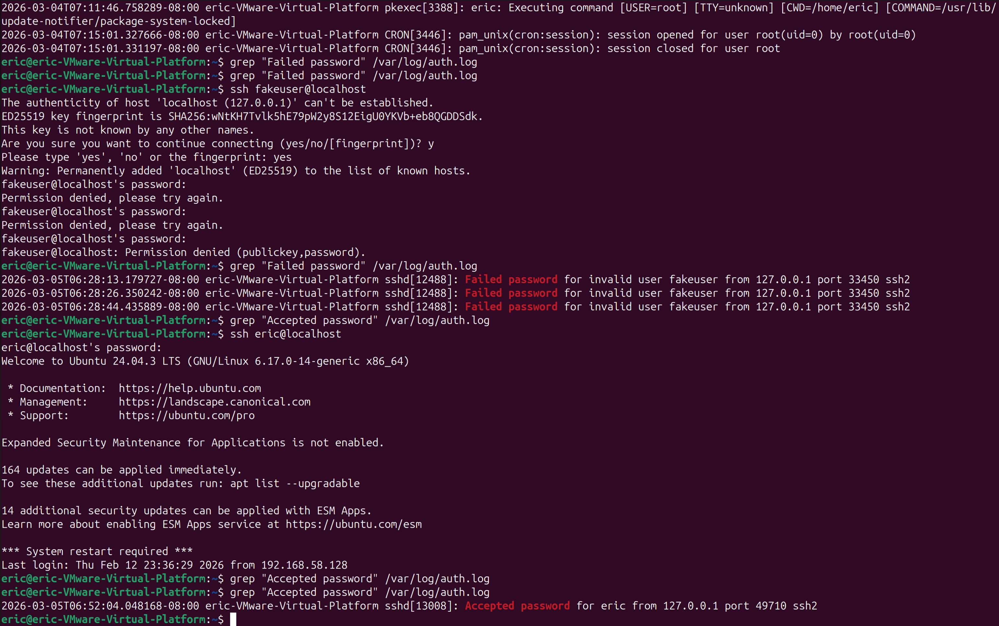

# SOC Lab 05 — Linux Log Analysis & Security Monitoring

## Table of Contents
1. [Executive Summary](#executive-summary)
2. [Lab Objectives](#lab-objectives)
3. [Environment Overview](#environment-overview)
4. [Log Investigation Workflow](#log-investigation-workflow)
5. [Log Analysis](#log-analysis)
6. [Detection Engineering Insights](#detection-engineering-insights)
7. [Evidence](#evidence)
8. [Conclusions](#conclusions)
9. [Next Steps](#next-steps)

---

## Executive Summary
This lab focuses on analyzing Linux authentication and system logs to detect suspicious activity.  
System logs provide critical visibility into user activity, authentication attempts, and privilege escalation events.

By investigating authentication logs, security analysts can identify brute-force attacks, unauthorized access attempts, and suspicious administrative activity.

This lab demonstrates how SOC analysts use Linux log data to monitor systems and detect potential security incidents.

---

## Lab Objectives

- Investigate Linux authentication logs
- Identify successful and failed login attempts
- Detect suspicious authentication activity
- Analyze privilege escalation using `sudo`
- Understand how log monitoring supports SOC detection workflows

---

## Environment Overview

**Operating System:** Operating System: Ubuntu Linux 24.04 (VMware Workstation Virtual Machine)

**Logs Analyzed**
- `/var/log/auth.log`

**Tools Used**
- `grep`
- `cat`
- `less`
- Linux terminal

---

## Log Investigation Workflow
### 1. View Authentication Logs

Authentication logs record login attempts, SSH access, and privilege escalation activity.  
Security analysts regularly review these logs to identify suspicious authentication behavior.

**Command:**

```bash
sudo cat /var/log/auth.log
```

**Explanation**

- `sudo` allows access to protected system logs
- `cat` prints the contents of the log file
- `/var/log/auth.log` contains authentication events such as SSH login attempts and sudo activity

This command allows analysts to review raw authentication activity on the system.

### 2. Detect Failed Login Attempts

Failed authentication attempts can indicate brute-force attacks or unauthorized login activity.  
Security analysts search authentication logs to identify repeated login failures and suspicious access attempts.

**Command:**

```bash
grep "Failed password" /var/log/auth.log
```

**Explanation**

- `grep` searches text within log files
- `"Failed password"` identifies unsuccessful SSH login attempts
- `/var/log/auth.log` contains authentication-related events

This command helps analysts quickly identify failed login attempts that may indicate malicious activity.

### 3. Identify Successful Logins

Successful authentication events are recorded when a user logs into the system using valid credentials.  
Security analysts review these entries to confirm legitimate access and detect unusual login activity.

**Command:**

```bash
grep "Accepted password" /var/log/auth.log
```

**Explanation**

- `grep` searches text within log files
- `"Accepted password"` identifies successful SSH login events
- `/var/log/auth.log` records authentication activity on the system

This command allows analysts to verify successful login events and correlate them with other security activity.

### 4. Investigate Sudo Privilege Escalation

Privilege escalation events occur when a user executes commands with elevated privileges using `sudo`.  
Monitoring these events helps security analysts detect unauthorized administrative activity.

**Command:**

```bash
grep "sudo" /var/log/auth.log
```

**Explanation**

- `grep` searches text inside log files
- `"sudo"` identifies commands executed with elevated privileges
- `/var/log/auth.log` records privilege escalation events

This command helps analysts review administrative actions performed on the system.

---

## Log Analysis

The investigation of `/var/log/auth.log` revealed several important authentication events.

Multiple failed SSH login attempts were detected for the user `fakeuser`. These attempts originated from `127.0.0.1`, which indicates the login attempts were generated locally during the lab simulation. In a real-world environment, repeated failed login attempts from external IP addresses may indicate brute-force or credential guessing attacks.

A successful SSH login event was also recorded for the legitimate user `eric`. This confirms that valid authentication events are logged using the phrase **"Accepted password"**, which security analysts can search for to confirm successful authentication.

Additionally, sudo activity was detected showing the user `eric` executing commands with elevated privileges. Monitoring sudo usage is important because attackers who gain initial access to a system often attempt privilege escalation to obtain administrative control.

These authentication logs demonstrate how SOC analysts can identify failed login attempts, legitimate access, and administrative activity during security investigations.

## Detection Engineering Insights

Authentication logs provide valuable visibility into user activity and system access patterns. Security analysts frequently use log queries like `grep` to quickly identify suspicious authentication behavior.

Repeated failed login attempts can indicate brute-force attacks, password spraying, or automated scanning tools attempting to gain unauthorized access. Monitoring for patterns such as multiple failed logins from the same IP address or attempts against multiple user accounts can help identify these attacks early.

Successful login events should also be monitored for anomalies such as logins occurring at unusual times or from unfamiliar IP addresses. Analysts often correlate successful login events with failed login attempts to determine whether attackers eventually gained access.

Sudo activity is another important indicator because attackers who compromise a user account frequently attempt privilege escalation to gain administrative control of a system.

By monitoring authentication logs and privilege escalation events, SOC analysts can detect unauthorized access attempts, investigate suspicious activity, and respond to potential security incidents.

## Evidence

All screenshots are stored in the `/screenshots` directory:

- `auth-log-view.png` — Viewing authentication logs
- `failed-ssh-logins-clean.png` — Failed SSH login attempts detected
- `successful-ssh-login-clean.png` — Successful SSH authentication event
- `sudo-activity.png` — Privilege escalation activity using sudo

These screenshots provide evidence of the authentication log investigation performed during this lab.








## Conclusions

This lab demonstrated how Linux authentication logs can be analyzed to identify security-relevant events such as failed login attempts, successful authentication, and privilege escalation activity.

By examining `/var/log/auth.log`, we were able to detect failed SSH login attempts, confirm successful user authentication, and observe administrative actions performed using `sudo`. These types of events are commonly reviewed by Security Operations Center (SOC) analysts when investigating suspicious activity or responding to security alerts.

Understanding how to quickly search and interpret authentication logs is an essential skill for security analysts, as it allows them to detect unauthorized access attempts, investigate user activity, and identify potential privilege escalation behavior on Linux systems.

## Next Steps

To continue developing SOC investigation and detection skills:

- **SOC Lab 06 — Detecting Port Scanning Activity**
- Generate network scanning activity using tools such as Nmap
- Capture and analyze scanning traffic using Wireshark
- Identify reconnaissance patterns commonly used by attackers

This progression expands from host-based monitoring into network-based threat detection.
